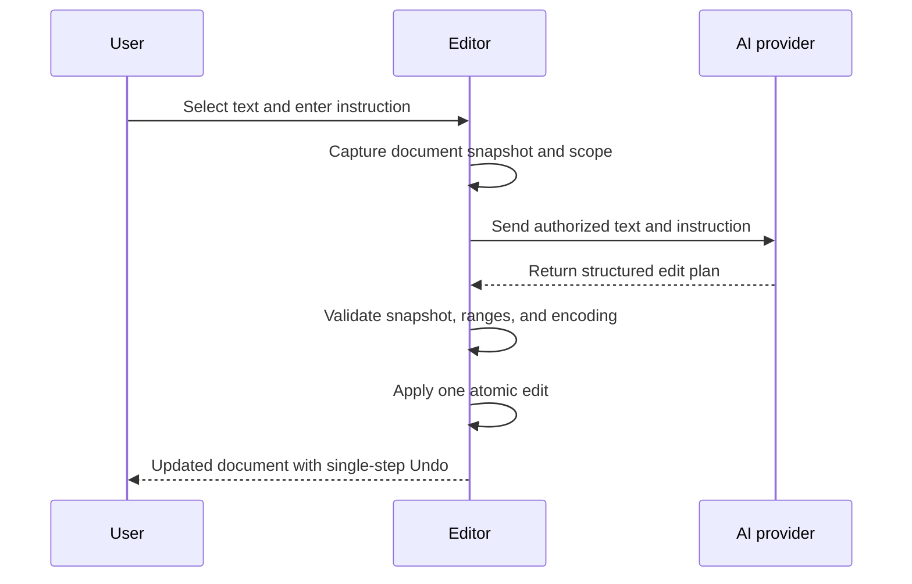

<div align="center">

# Notepad++ AI

### Precision AI editing, engineered into a native Windows editor.

Transform selected text or an entire document with natural-language instructions—using your own AI provider, a validated edit protocol, secure credential storage, and a single-step undo.


</div>


---

## Editing at the speed of intent

Notepad++ AI brings provider-backed editing directly into a fast, familiar, Windows-native workspace. Instead of moving content into a browser, composing a prompt elsewhere, and manually reconciling the result, you describe the transformation where the text already lives.

The implementation is designed around controlled mutation rather than unrestricted generation: AI responses are parsed as structured edit plans, validated against the document snapshot, checked against the authorized range, and applied as one atomic, undoable editor operation.

## Highlights

| Feature | Why it matters |
|---|---|
| Native AI Edit command | Invoke AI without leaving the editor or changing workflows |
| Selection-aware scope | Transform only the selected content—or intentionally target the full document |
| Structured edit plans | Provider output must conform to an expected mutation contract |
| Snapshot validation | Stale responses are rejected if the document changed during the request |
| Atomic application | Every accepted AI transformation becomes one undoable action |
| Bring your own provider | Choose Google Gemini or an OpenAI-compatible OpenRouter endpoint |
| Secure API-key storage | Secrets live in Windows Credential Manager, not `config.xml` |
| Connection testing | Validate endpoint, model, and credentials before editing |
| Native performance | AI capabilities are integrated into the C++ editor rather than wrapped around it |

## How AI Edit works



This design protects the active document from stale, out-of-range, or malformed model output while preserving the speed of generative editing.

## Use AI Edit

1. Open a writable UTF-8 document.
2. Select the exact text you want to transform—or leave the selection empty to target the current document.
3. Choose **AI → AI Edit…** or press **Ctrl+Alt+I**.
4. Type an instruction into the inline `AI >` prompt.
5. Press **Enter** to apply the validated result, or **Esc** to cancel.
6. Use a single **Undo** to revert the complete AI operation.

> [!NOTE]
> AI Edit currently supports one selection at a time. A request never silently expands beyond the selected text or authorized document scope.

## Configure a provider

Open **Settings → Preferences → AI**, then:

1. Choose **Google Gemini** or **OpenRouter (OpenAI-compatible)**.
2. Enter the provider endpoint and API key.
3. Select or enter the model.
4. Click **Save**.
5. Use **Test connection** to verify the configuration.

The provider, endpoint, and model are stored in `config.xml`. The API key is stored separately in Windows Credential Manager.

## Trust boundaries

AI-assisted editing should be predictable enough for real work. Notepad++ AI enforces several boundaries before changing a document:

- Only the user-authorized selection or document text is sent.
- The request captures the active document state before contacting the provider.
- The response must match the structured edit-plan schema.
- Every proposed range is checked against the authorized scope.
- The operation is rejected if the document changed while the request was in flight.
- AI edits apply as a single editor transaction for clean rollback.
- Provider secrets are excluded from editor configuration files.

> [!WARNING]
> Authorized document content and the instruction are transmitted to the provider you configure. Review your provider's data-handling policy before using AI Edit with confidential or regulated information.

## Architecture

```text
notepad_ai/
├── PowerEditor/       # Windows application and AI integration
├── scintilla/         # Editing component
├── lexilla/           # Syntax lexers
├── boostregex/        # Regex support
├── docs/              # Project documentation and visual assets
├── BUILD.md           # Complete build instructions
└── SUPPORTED_SYSTEM.md
```

The application remains a native C++ editor built on Scintilla and Lexilla. AI settings, network interaction, structured response handling, scope validation, and atomic application are integrated into the existing editor lifecycle.

## Build from source

### Requirements

- Windows
- Visual Studio 2022 17.5 or newer
- Desktop development with C++
- MSVC v143 toolset for the desired target: Win32, x64, or ARM64

### Visual Studio

```text
PowerEditor\visual.net\notepadPlus.sln
```

1. Open the solution.
2. Choose **Debug** or **Release**.
3. Select **Win32**, **x64**, or **ARM64**.
4. Build the solution.

The build produces `notepad++.exe` and automatically builds the required Scintilla and Lexilla static libraries.

MinGW-w64 and GCC workflows are also supported. See [BUILD.md](./BUILD.md) for the full toolchain instructions.

## Provider compatibility

| Provider | Configuration |
|---|---|
| Google Gemini | Gemini endpoint with model substitution and API key |
| OpenRouter | OpenAI-compatible endpoint, selected model, and API key |

The provider layer is configuration-driven, allowing the editor to retain the same validation and application pipeline regardless of the selected model.

## Contributing

Before proposing a change:

1. Read [CONTRIBUTING.md](./CONTRIBUTING.md).
2. Build the affected architecture locally.
3. Validate both conventional editor behavior and the AI Edit flow.
4. Confirm that provider errors, cancellation, malformed output, and stale-document cases fail safely.

## License

Distributed under the [GNU General Public License](./LICENSE). This project builds on the Notepad++ codebase and preserves its native editing foundation while extending it with controlled AI-assisted editing.

---

<div align="center">

Keep the editor fast. Make every AI edit deliberate.

</div>
