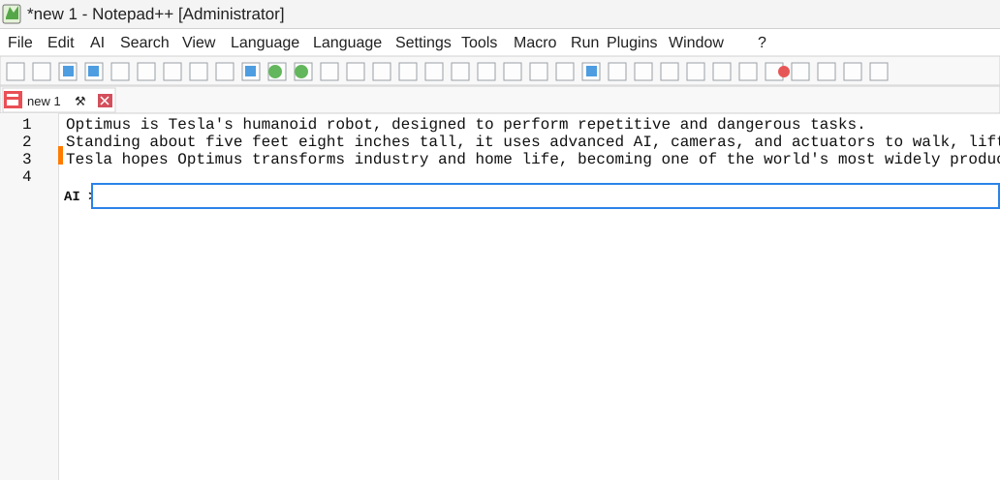

# Notepad++ AI

A Windows-native text editor focused on precise, provider-backed **AI Edit** actions. Describe the change you want, and the editor applies a validated edit plan to the selected text or current document.

## AI Edit

- Open **AI → AI Edit…** or press **Ctrl+Alt+I**.
- Enter an instruction in the inline `AI >` prompt, then press **Enter** to apply it. Press **Esc** to cancel.
- With text selected, AI Edit can modify only that selection. Without a selection, it can modify the complete document.
- Results are validated against the captured document snapshot and applied as one undoable action, so a single **Undo** reverts the full AI edit.

AI Edit requires a writable UTF-8 document and supports one selection at a time.

## Configure an AI provider

1. Open **Settings → Preferences → AI**.
2. Select **Google Gemini** or **OpenRouter (OpenAI-compatible)**.
3. Enter your API key, select the model and endpoint if needed, then click **Save**.
4. Select **Test connection** to confirm the provider is available.

API keys are stored in **Windows Credential Manager**, not in the editor configuration file. The selected provider, model, and endpoint are saved in `config.xml`.

## Data and editing boundaries

AI Edit sends your instruction and the authorized document text to the provider you configure. Keep this in mind when working with sensitive content.

The application restricts the provider response to a structured edit plan. Every proposed change is checked against the original document snapshot and must stay inside the selected text or document scope before it is applied. If the document changes while a request is in progress, the result is rejected rather than applied to stale content.

## Build

Build the Windows application from source by following [BUILD.md](BUILD.md).

## License

This project is distributed under the [GNU General Public License](LICENSE).
